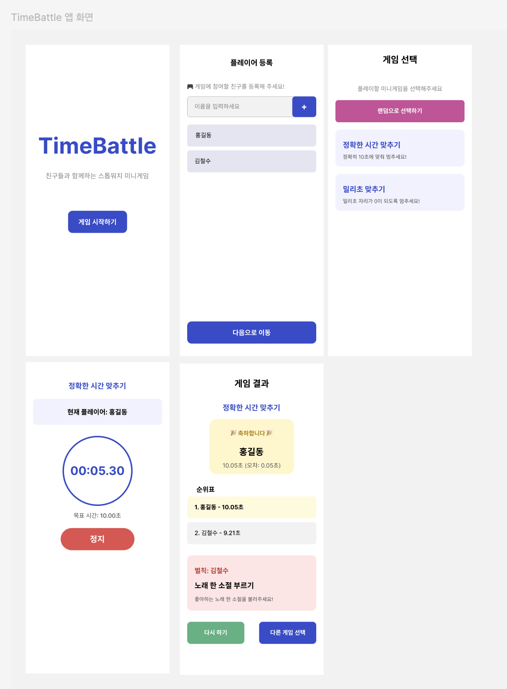
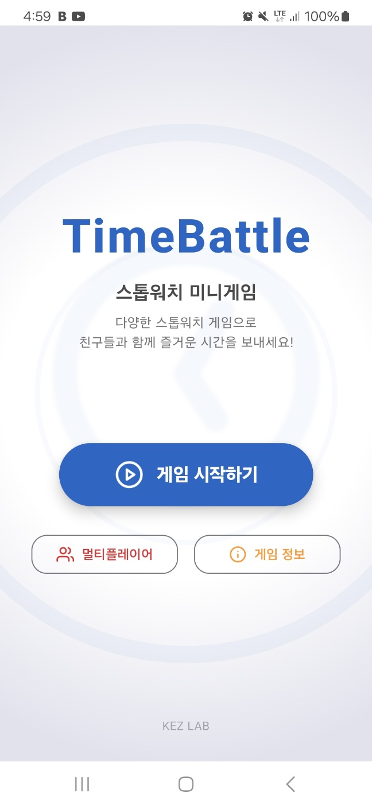
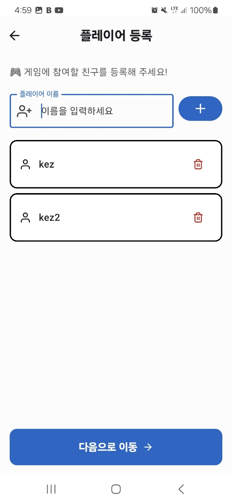
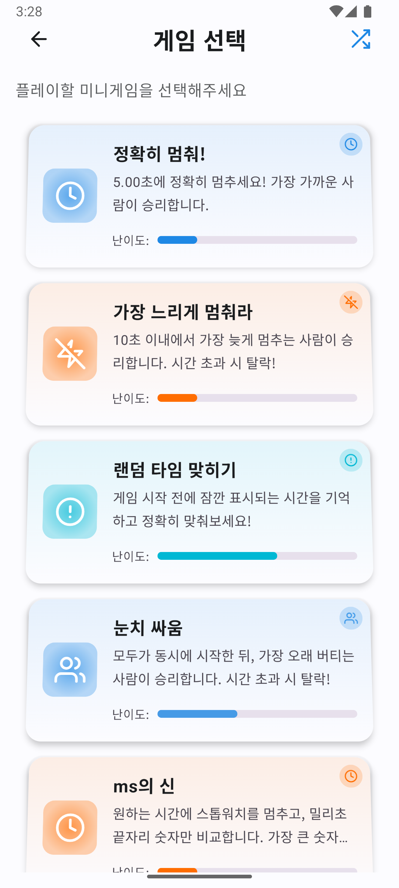
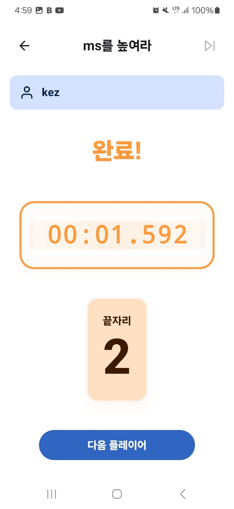
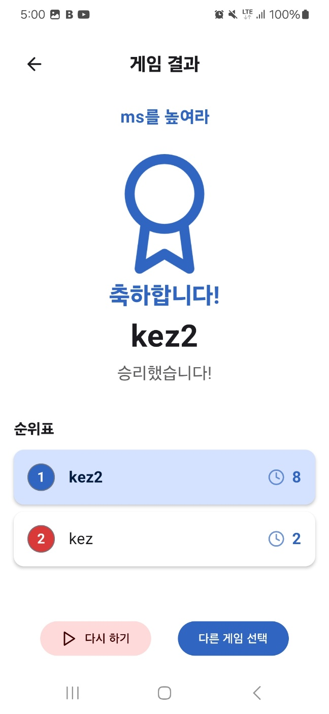

# TimeBattle - 스톱워치 미니게임

  

## 프로젝트 소개
TimeBattle은 친구들과 함께 즐길 수 있는 스톱워치 기반 미니게임 컬렉션입니다. 다양한 스톱워치 게임들을 통해 친구들과 재미있게 경쟁할 수 있습니다. Compose Multiplatform을 활용하여 Android와 iOS 플랫폼 모두에서 동일한 사용자 경험을 제공합니다.

이 프로젝트는 [Cursor AI](https://cursor.sh/)를 활용하여 개발되었으며, 다음 MCP(Machine Control Protocol) 도구들을 적극 활용했습니다:
- **GitHub MCP**: 저장소 관리, 이슈 추적, PR 생성 및 CI/CD 파이프라인 구성
- **Figma MCP**: UI/UX 디자인 및 에셋 생성 
- **Sequential Thinking MCP**: 복잡한 문제 해결을 위한 단계별 논리적 사고 프로세스

## 게임 소개

### 정확히 멈춰!
지정된 시간 (5초)에 최대한 가깝게 스톱워치를 멈추는 게임입니다. 목표 시간에 가장 가깝게 멈춘 플레이어가 승리합니다.

### 가장 느리게 멈춰라
10초 이내에서 가장 늦게 멈추는 사람이 승리합니다. 하지만 10초를 초과하면 탈락!

### 랜덤 타임 맞히기
게임 시작 전에 짧게 표시되는 랜덤한 시간을 기억하고 정확히 맞추는 게임입니다.

### 눈치 싸움
모두가 동시에 시작한 뒤, 15초 내에서 가장 오래 버티는 사람이 승리합니다. 제한 시간을 초과하면 탈락합니다.

### ms를 높여라
자유롭게 스톱워치를 멈추고, 밀리초 끝자리 숫자만 비교합니다. 가장 큰 숫자가 승리합니다!

## 기술 스택

### 프레임워크 및 라이브러리
- **Kotlin Multiplatform**: 안드로이드 및 iOS 공통 코드 작성
- **Compose Multiplatform**: 크로스 플랫폼 UI 구현
- **Material 3**: 디자인 시스템
- **Kotlinx Coroutines**: 비동기 프로그래밍
- **Kotlinx Datetime**: 크로스 플랫폼 날짜/시간 처리
- **Feather Icons**: 아이콘 리소스

### 아키텍처 및 패턴
- **MVVM 패턴**: UI와 비즈니스 로직 분리
- **상태 기반 UI**: 단방향 데이터 흐름
- **Composable 함수 컴포넌트화**: 재사용 가능한 UI 요소

## 주요 기능
- 다양한 스톱워치 기반 미니게임
- 게임 결과 정산 및 순위 표시
- 꼴찌 플레이어를 위한 랜덤 벌칙
- 재미있는 승리 애니메이션

## 개발 및 CI/CD
이 프로젝트는 GitHub Actions를 활용한 CI/CD 파이프라인을 구축하여 다음과 같은 자동화 작업을 수행합니다:
- 자동 유닛 테스트 실행
- 안드로이드 APK 빌드
- 테스트 리포트 및 빌드 아티팩트 생성
- Dependabot을 통한 의존성 자동 업데이트

## 실행 방법

### 준비 사항
- [KDoctor](https://github.com/Kotlin/kdoctor)로 시스템 환경 확인
- JDK 17 이상 설치
- `local.properties` 파일에 Android SDK 경로 설정

### Android
- Android Studio에서 프로젝트 열고 실행
- 또는 `./gradlew :composeApp:assembleDebug` 명령으로 APK 빌드
  - `composeApp/build/outputs/apk/debug/composeApp-debug.apk` 경로에서 APK 파일 확인

### iOS
- Xcode에서 `iosApp/iosApp.xcproject` 열고 실행
- 또는 Android Studio의 [Kotlin Multiplatform Mobile plugin](https://plugins.jetbrains.com/plugin/14936-kotlin-multiplatform-mobile) 사용

### Desktop
- `./gradlew :composeApp:run` 명령으로 실행
- 핫 리로드: `./gradlew :composeApp:runHot`

## 스크린샷
### Figma MCP 초안

<table>
  <tr>
    <td></td>
    <td></td>
    <td></td>
  </tr>
  <tr>
    <td></td>
    <td></td>
    <td></td>
  </tr>
</table>

## 라이센스
MIT License

